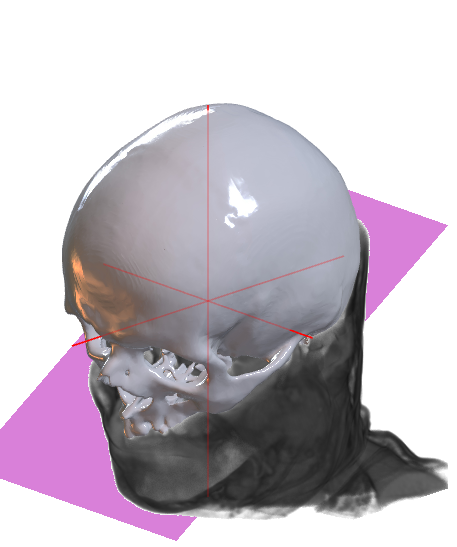
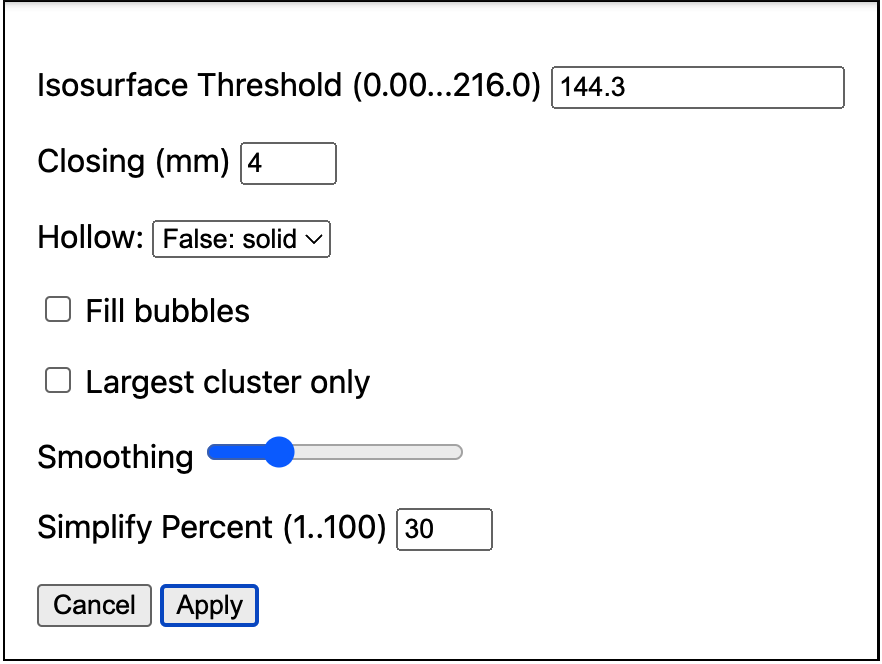

### ct2print voxels to mesh

A basic example of converting a voxel-based image to a simplified mesh. This interactive drag-and-drop web page allows you to create meshes that can be used with a 3D printer.



### Usage

1. Open the [live demo](https://niivue.github.io/ct2print/).
2. **Option 1** Use the `Volume` pull-down menu to select an image.
3. **Option 2** If your image is in NIfTI format, drag and drop the file onto the web page.
4. **Option 3** If your image is in DICOM format, use the `Select DICOM` button to import your image.
5. Note when you click on the image, the voxel intensity is shown in the status bar at the bottom-left of the web page. You can decide a nice intensity threshold to segment your image (e.g. for a CT scan, bone will be brighter than soft tissue).
6. Press the `Create Mesh` button and select your preferred settings: 

 - The [Isosurface](https://en.wikipedia.org/wiki/Marching_cubes) is the voxel intensity used to discriminate the mesh surface. See the previous step for detials. By default, this value is set to the [Otsu threshold](https://en.wikipedia.org/wiki/Otsu%27s_method).
 - [Closing](https://en.wikipedia.org/wiki/Closing_(morphology)) removes small crevices and cavities in your mesh which can plague printing.
 - Fill bubbles will remove any cavities, this includes large cavities for example the ventricles for a brain scan.
 - The `Largest cluster only` will only extract a single mesh. For example, with the `Iguana` demo this extracts only the skull without the [scleral rings](https://en.wikipedia.org/wiki/Scleral_Ring).
 - You can choose `Smoothing` to make the surfaces less jagged (note this can create self intersecting triangles that can confound some printers).
 - You can choose to `Simplify` [reduce the number of triangles](https://github.com/sp4cerat/Fast-Quadric-Mesh-Simplification) to create smaller files (note this can create self intersecting triangles that can confound some printers).
7. Once you have set your preferences, press `Apply`.
8. You will see the mesh appear and can interactively view it. If you are unhappy with the result, repeat step 6 with different settings. If you want to print the results, press the `Save Mesh` button.


### For Developers

You can serve a hot-reloadable web page that allows you to interactively modify the source code.

```bash
git clone https://github.com/niivue/ct2print
cd ct2print
npm install
npm run dev
```

### Links

 - [Will Usher](https://github.com/Twinklebear/webgl-marching-cubes) ported [Marching Cubes](https://paulbourke.net/geometry/polygonise/) to JavaScript.
 - This project includes a pure JavaScript port of Sven Forstmann's [Fast Quadric Mesh Simplification](https://github.com/sp4cerat/Fast-Quadric-Mesh-Simplification)
 - [Tim Knip](https://github.com/timknip/mesh-decimate/tree/master) provides a ThreeJS project that provides both WASM and native JavaScript mesh decimation. Try the [live demo](https://neurolabusc.github.io/simplifyjs/).