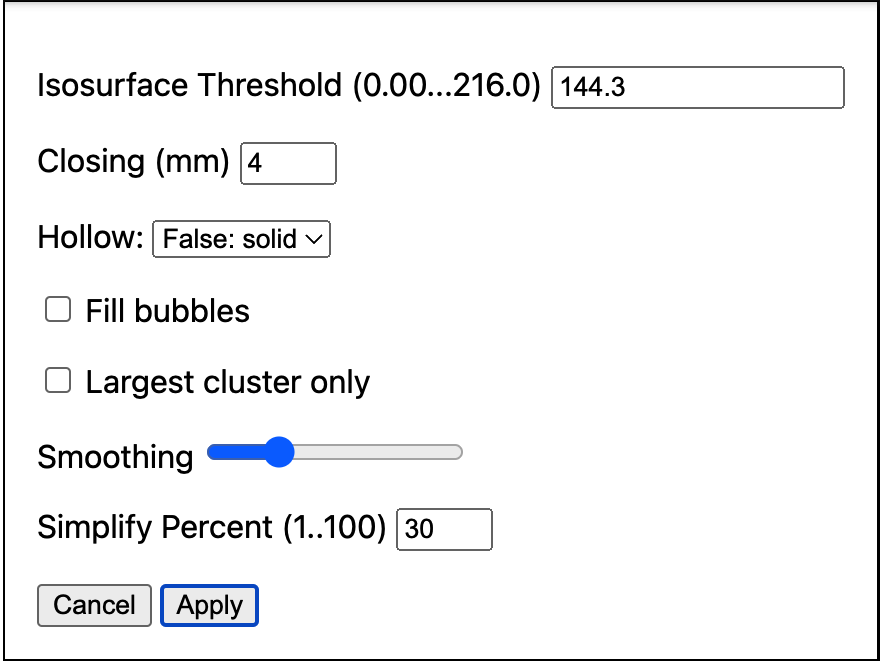

### ct2print voxels to mesh

A basic example of converting a voxel-based image to a simplified mesh. This interactive drag-and-drop web page allows you to create meshes that can be used with a 3D printer.

**No data is sent to a server. Everything happens in *your* browser window, on *your* machine.**


### Usage

1. Open the [live demo](https://niivue.github.io/ct2print/).
2. **Option 1** The web page automatically loads with a default T1 MRI scan. If you want to use this scan, go to step 5.
3. **Option 2** If your T1 MRI scan is in NIfTI format, drag and drop the file onto the web page.
4. **Option 3** If your image is in DICOM format, it may load if you drag and drop the files. If this fails, convert your images with [dcm2niix](https://niivue.github.io/niivue-dcm2niix/) and save the result as a NIfTI format file that brain2print can open.
5. Note when you click on the image, the voxel intensity is shown in the status bar at the bottom-left of the web page. You can decide a nice intensity threshold to segment your image (e.g. for a CT scan, bone will be brighter than soft tissue).
6. Press the `Create Mesh` button and select your preferred settings: 

  - The [Isosurface Threshold](https://en.wikipedia.org/wiki/Marching_cubes) is the voxel intensity used to discriminate the mesh surface. See the previous step for detials. By default, this value is set to the [Otsu threshold](https://en.wikipedia.org/wiki/Otsu%27s_method).
  - The Hollow pull-down menu allows you to create a solid object, or a hollow one that uses less materials (but requires an escape hole).
  - You can choose `Smoothing` to make the surfaces less jagged at the expense of computation time.
  - You can choose to `Simplify` to reduce the number of triangles and create smaller files.
7. Once you have set your preferences, press `Apply`.
8. You will see the mesh appear and can interactively view it. If you are unhappy with the result, repeat step 6 with different settings. If you want to print the results, press the `Save Mesh` button.


### For Developers

You can serve a hot-reloadable web page that allows you to interactively modify the source code.

```bash
git clone https://github.com/niivue/ct2print
cd ct2print
npm install
npm run dev
```

### Alternatives

ct2print makes a mesh from the brightest voxels in the image. This works well for extracting the brightest tissues - for example bone from computerized axial tomography. However, if your iamge is a T1-weighted MRI scan of the head, you may prefer [brain2print](https://github.com/niivue/brain2print) which uses AI methods to segment brain tissue.

### References

This web page combines three packages developed by our team:

- [niimath](https://github.com/rordenlab/niimath) for creating hollow objects. [Citation](https://pubmed.ncbi.nlm.nih.gov/39268148/).
- [niivue](https://github.com/niivue/niivue) reading images and visualization.
- [ITK-Wasm](https://github.com/InsightSoftwareConsortium/ITK-Wasm) for voxel-to-mesh and mesh processing. [Citation](https://proceedings.scipy.org/articles/TCFJ5130.

### Data Sources

You can provide your own voxel-based images, but here are a few other sources:

 - [MorphoSource](https://www.morphosource.org/) is a digital repository for 3D data of biological and cultural specimens, supporting open access to scans and models for research, education, and public use.
 - [DigiMorph](https://www.digimorph.org/) provides high-resolution 2D and 3D visualizations of vertebrate and invertebrate morphology, primarily derived from CT scans, to support comparative anatomy and evolutionary research.

## Citation

  - Rorden C, McCormick M, Hanayik T, Masoud M, Plis SM, ([2025](https://www.nature.com/articles/s41598-025-00014-5?utm_source=rct_congratemailt&utm_medium=email&utm_campaign=oa_20250505&utm_content=10.1038/s41598-025-00014-5)) brain2print AI powered web tool for creating 3D printable brain models. Scientific Reports. 15: 15664. doi:10.1038/s41598-025-00014-5
